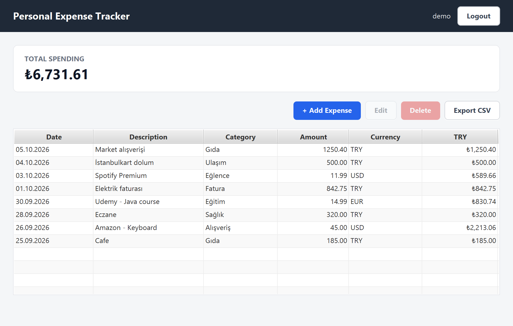
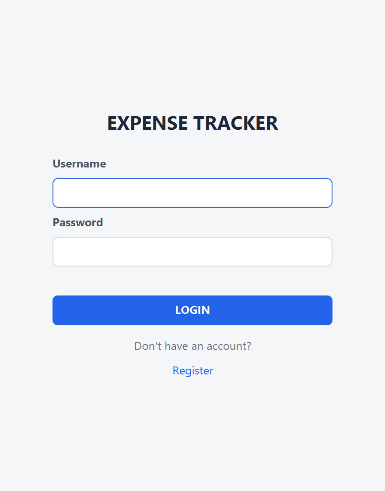
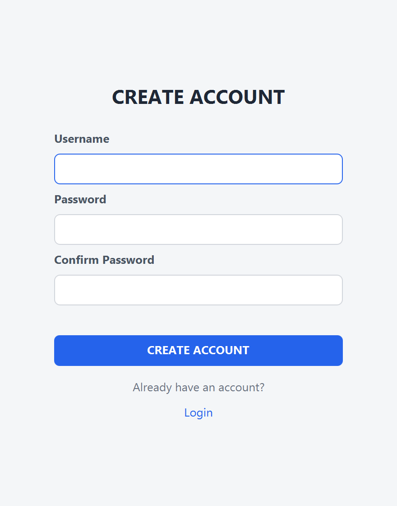
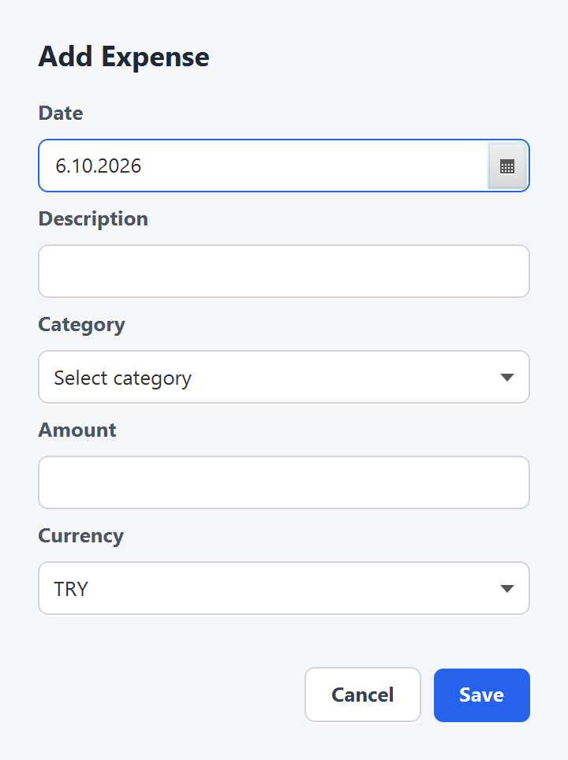
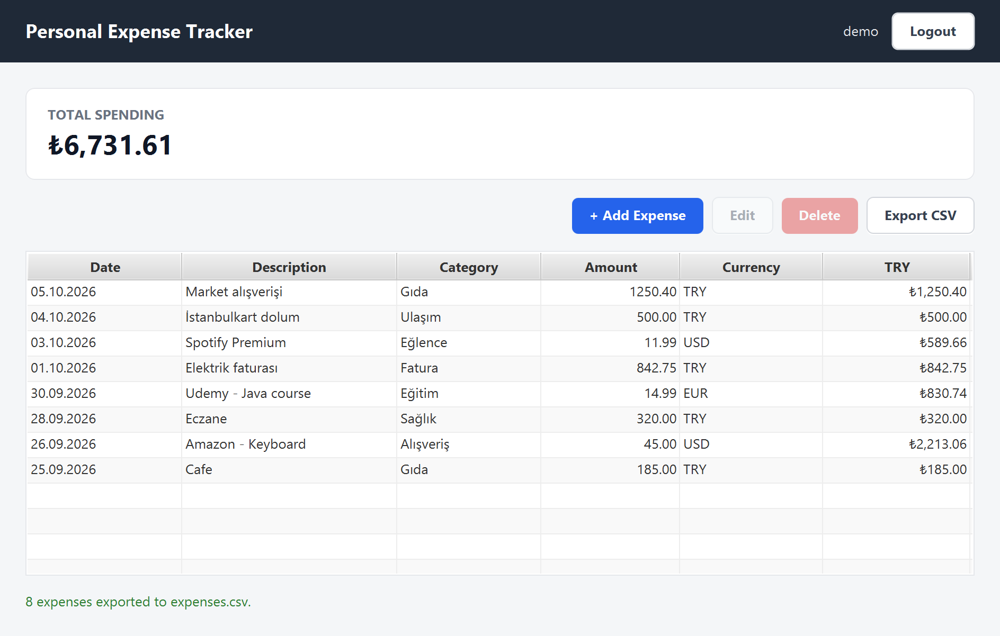

# Personal Expense Tracker

JavaFX + PostgreSQL kullanılarak geliştirilmiş kişisel harcama takip uygulaması.
Her kullanıcı yalnızca kendi harcamalarını görür; TRY, USD ve EUR harcamalar güncel kur ile otomatik olarak TL'ye çevrilir.



## Features

- User registration / login
- Forgot password (kayıtta seçilen güvenlik sorusu ile şifre sıfırlama; cevap BCrypt ile hash'lenir)
- Session timeout (hareketsiz geçen `session.timeout.minutes` dakika sonunda oturum kapanır, varsayılan 15)
- Password hashing (BCrypt, veritabanında düz metin şifre tutulmaz)
- User-specific expenses (her sorgu `user_id` ile sınırlıdır)
- Expense CRUD (ekleme / düzenleme ayrı pencerede, silme onaylı)
- Income CRUD (gelirler de kur ile TL'ye çevrilir)
- Net balance (toplam gelir − toplam harcama, dashboard'da)
- Reports (tarih aralığına göre gelir/harcama/net özeti, kategori dağılımı, aylık gelir-harcama grafiği)
- Category management (her kullanıcıya varsayılan kategoriler oluşturulur)
- TRY / USD / EUR support
- Live exchange rate API ([Frankfurter](https://frankfurter.dev), API anahtarı gerekmez)
- Automatic TRY conversion (kur ve TL karşılığı kayıt anında saklanır)
- CSV export (yalnızca giriş yapan kullanıcının harcamaları)
- Input validation ve anlaşılır hata mesajları (internet yoksa: *"Exchange rate could not be retrieved..."*)
- PostgreSQL persistence

## Technologies

- Java 17
- JavaFX 21 (FXML + CSS)
- PostgreSQL + JDBC
- jBCrypt
- Jackson
- Java HttpClient
- Maven (Maven Wrapper dahil)

## Architecture

```
FXML (login, register, forgot-password, dashboard, expense-dialog, income-dialog, reports)
 ↓
Controller
 ↓
Service (AuthService, ExpenseService, IncomeService, ReportService, ExportService)
 ↓
DAO (UserDAO, CategoryDAO, ExpenseDAO, IncomeDAO)
 ↓
PostgreSQL

CurrencyService
 ↓
REST API (Frankfurter)
```

```
src/main/java/com/expenseapp/
├── config/       DatabaseConfig, DatabaseInitializer
├── controller/   LoginController, RegisterController, ForgotPasswordController, DashboardController,
│                 ExpenseDialogController, IncomeDialogController, ReportsController, SessionTimeoutManager
├── dao/          UserDAO, CategoryDAO, ExpenseDAO, IncomeDAO
├── model/        User, Category, Expense, Income, CategoryTotal, MonthlyTotal, Currency, CurrencyResponse
├── service/      AuthService, ExpenseService, IncomeService, ReportService, CurrencyService, ExportService
└── util/         PasswordUtil, SessionManager, ValidationUtil, FormatUtil
src/main/resources/
├── config/       application.properties.example
├── css/          style.css
├── db/           schema.sql
└── fxml/         *.fxml
```

## Setup

Gereksinimler: JDK 17+, PostgreSQL. Maven kurulu olmasına gerek yoktur (`mvnw` kullanılır).

1. PostgreSQL'de veritabanı oluştur:
   ```sql
   CREATE DATABASE expense_tracker;
   ```
2. `src/main/resources/config/application.properties.example` dosyasını aynı klasöre `application.properties` adıyla kopyala.
3. Database bilgilerini doldur:
   ```properties
   db.url=jdbc:postgresql://localhost:5432/expense_tracker
   db.username=YOUR_USERNAME
   db.password=YOUR_PASSWORD
   currency.api.url=https://api.frankfurter.dev/v1/latest
   session.timeout.minutes=15
   ```
   `application.properties` `.gitignore` içindedir, repoya eklenmez.
4. Maven ile çalıştır:
   ```bash
   ./mvnw javafx:run        # Windows: mvnw.cmd javafx:run
   ```
   Tablolar ilk açılışta `db/schema.sql` ile otomatik oluşturulur.
5. Register olup kullanmaya başla.

## Database

| Tablo        | Kolonlar                                                                                                                         |
|--------------|----------------------------------------------------------------------------------------------------------------------------------|
| `users`      | `id`, `username` (unique), `password_hash` (BCrypt), `security_question`, `security_answer_hash` (BCrypt), `created_at`          |
| `categories` | `id`, `user_id` → users, `name` (kullanıcı başına unique)                                                                        |
| `expenses`   | `id`, `user_id` → users, `category_id` → categories, `expense_date`, `description`, `amount`, `currency` (TRY/USD/EUR), `exchange_rate`, `amount_try`, `created_at`, `updated_at` |
| `incomes`    | `id`, `user_id` → users, `income_date`, `description`, `amount`, `currency` (TRY/USD/EUR), `exchange_rate`, `amount_try`, `created_at`, `updated_at` |

- `expenses (category_id, user_id)` → `categories (id, user_id)` bileşik yabancı anahtarı, bir harcamanın başka kullanıcının kategorisine bağlanmasını veritabanı seviyesinde engeller.
- `amount > 0` ve `currency IN ('TRY','USD','EUR')` CHECK kısıtlarıyla korunur.
- Kullanıcı silinirse kategorileri ve harcamaları `ON DELETE CASCADE` ile silinir.

## Screenshots

| Login | Register |
|-------|----------|
|  |  |

| Add / Edit Expense | CSV Export |
|--------------------|------------|
|  |  |
